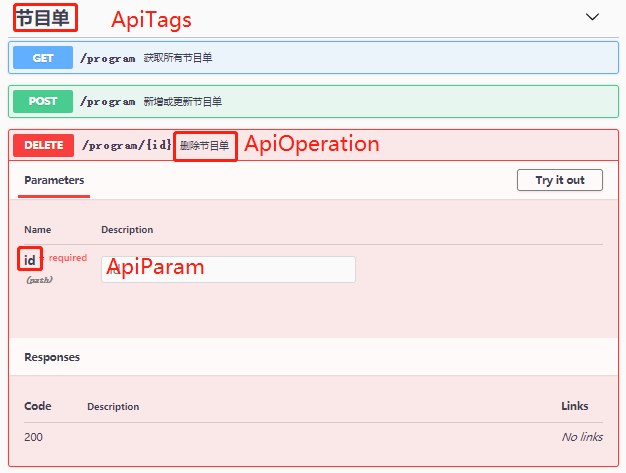

### DTO中定义

```javascript
import { ApiProperty } from '@nestjs/swagger';

export class DemoDTO {

 @ApiProperty({ description: '描述信息', default: '默认值' })
 
 id: number;

}
```

### control 中使用

```javascript
import { ApiOperation, ApiParam, ApiTags } from '@nestjs/swagger';

@Controller('program')
export class ProgramController {
  	constructor(private readonly programService: ProgramService) {}
    @ApiTags('节目单')
    @ApiOperation({ summary: '删除节目单' })
        @ApiParam({ name: 'id' })
        @Delete(':id')
        async remove(@Param() params) {
        return await this.programService.remove(params.id);
    }
}

```


