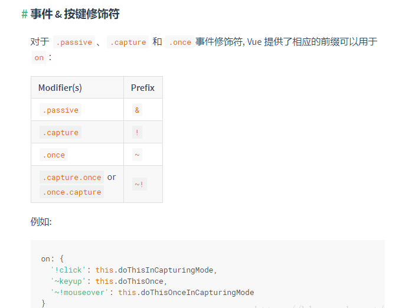

思路：父层绑定click 阻止捕获事件
不是render出来的组件也同理
```javascript
render: (h, params) => {
  const {
    id,
    enableStatus
  } = params.row;
  return h('div', {
    on: {
      '!click': ()=> {
        event.stopPropagation();
        ctx.changeStatus(params.row, this)
      }
    }
  }, [
    h("i-switch", {
        props: {
          value: enableStatus === 'ENABLE', // 控制开关的打开或关闭状态，官网文档属性是value
        },
      },
      '启用'),
    h('span', {
      class: ['margin-x'],
    }, enableStatus === 'ENABLE' ? '启用' : '禁用')
  ], );
},
```
##### 事件修饰符补充

