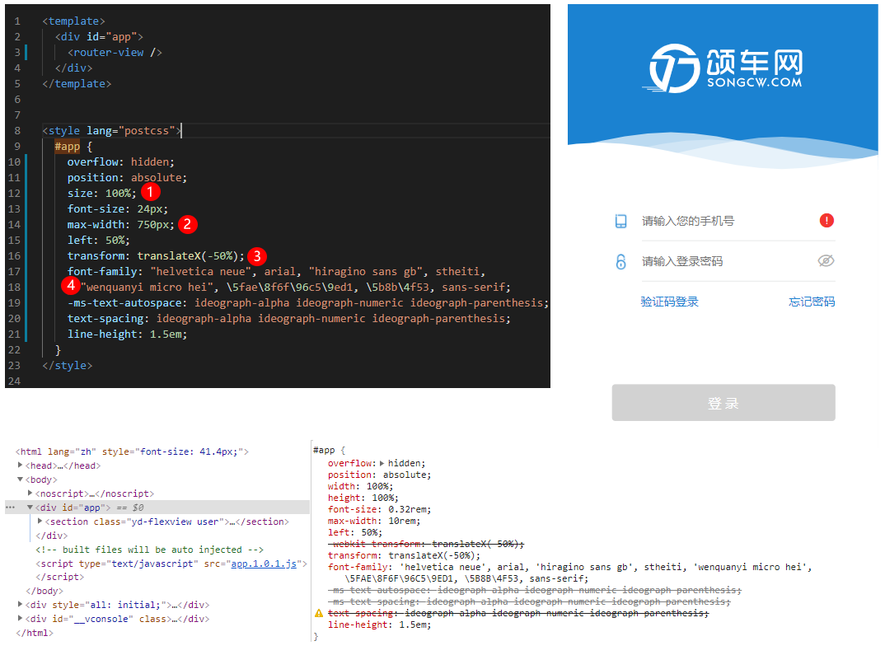
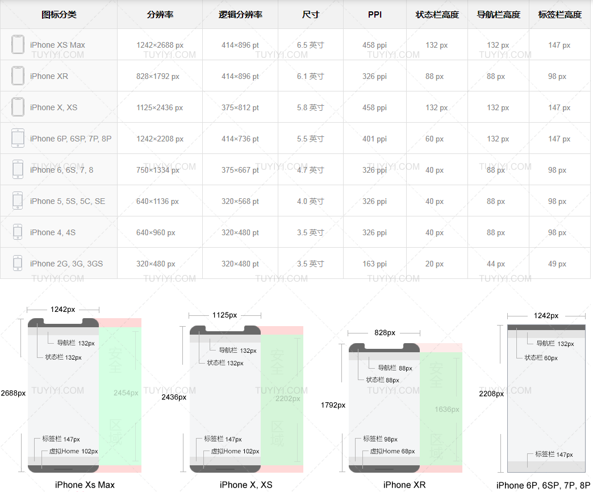

### 基本概念


- 分辨率：例如 640*1136 就是说我的屏幕宽度有 640个像素点，高度有 1136 个像素点。

- 屏幕尺寸：指的是屏幕对角线的长度

- dpi ：（Dots Per Inch），指每英寸的像素，是衡量打印机打印精度的主要参数之一(对于电脑屏幕而言和PPI是一个意思)

- ppi：PPI(Pixel Per Inch)表示数字影像的解析度（屏幕像素密度，即每英寸(1英寸=2.54厘米)聚集的像素点个数，这里的一英寸还是对角线长度）

- **px**：像素单位。最基础的图像构成元素单位，css pixel 逻辑像素，浏览器使用的单位

- **dpr**：devicepixelRatio 设备像素缩放比(物理像素和设备像素比)

- pt: 设备像素(又称为物理像素): 指设备能控制显示的最小物理单位，意指显示器上一个个的点。从屏幕在工厂生产出的那天起，它上面设备像素点就固定不变了，和屏幕尺寸大小有关。

> 设备像素(也叫密度无关像素或逻辑像素)：可以认为是计算机坐标系统中得一个点，这个点代表一个可以由程序使用的虚拟像素(比如: css像素)，这个点是没有固定下小的，越小越清晰，然后由相关系统转换为物理像素。

### viewport解析

- width：控制 viewport 的大小，可以指定的一个值，如 600，或者特殊的值，如 device-width 为设备的宽度（单位为缩放为 100% 时的 CSS 的像素）。
- height：和 width 相对应，指定高度。
- initial-scale：初始缩放比例，也即是当页面第一次 load 的时候缩放比例。
- maximum-scale：允许用户缩放到的最大比例。
- minimum-scale：允许用户缩放到的最小比例。
- user-scalable：用户是否可以手动缩放。

```html
<meta name="viewport" content="width=device-width, initial-scale=1, maximum-scale=1, minimum-scale=1, user-scalable=no">	
```

#### rem解决方案 适配所有屏幕尺寸

```javascript
(function(win, doc) {
  var docEl = doc.documentElement;
  var docWidth;
  function setRemUnit() {
    var ua = navigator.userAgent;
    var ipad = ua.match(/(iPad).*OS\s([\d_]+)/),
    isIphone = !ipad && ua.match(/(iPhone\sOS)\s([\d_]+)/),
    isAndroid = ua.match(/(Android)\s+([\d.]+)/),
    isMobile = !!isIphone || !!isAndroid || !!ipad
    if (isMobile) {
      docWidth = docEl.clientWidth ;
    } else {
      //  如果是电脑端打开，设置最大根节点fontsize
      docWidth = docEl.clientWidth > 640 ? 640:docEl.clientWidth ;
    }
    var rem = docWidth / 10;
    docEl.style.fontSize = rem + 'px';
  }
  win.addEventListener('resize', function() {
    setRemUnit();
  }, false);
  win.addEventListener('pageshow', function(e) {
    if (e.persisted) {
      setRemUnit();
    }
  }, false);
  setRemUnit();
})(window, document)
```



### PostCss实现工程化

```javascript
module.exports = {
  plugins: {
    autoprefixer: {},
    'postcss-import': {},
    'postcss-nested': {},
    'postcss-size': {},
    'postcss-adaptive': { remUnit: 75, autoRem: true },
  },
};

```

- ##### autoprefixer => browserslist

```
> 1%
not ie <= 8
iOS >= 7
Android > 4.1
Firefox > 20
last 2 versions
```

- ##### postcss-nested

```
:root {
  --fontSize: 1rem;
  --mainColor: rgba(18, 52, 86, 0.47059);
  --centered: {
      display: flex;
      align-items: center;
      justify-content: center;
  };
}
body {
    color: var(--mainColor);
    font-size: var(--fontSize);
    line-height: calc(var(--fontSize) * 1.5);
    padding: calc((var(--fontSize) / 2) + 1px);
}
.centered {
    @apply --centered;
}
======================== 分隔符 ========================

body {
    color: rgba(18, 52, 86, 0.47059);
    font-size: 1rem;
    line-height: 1.5rem;
    padding: calc(0.5rem + 1px);
}
.centered {
    display: -webkit-box;
    display: -ms-flexbox;
    display: flex;
    -webkit-box-align: center;
        -ms-flex-align: center;
            align-items: center;
    -webkit-box-pack: center;
        -ms-flex-pack: center;
            justify-content: center;
}

```


### 设计尺寸


