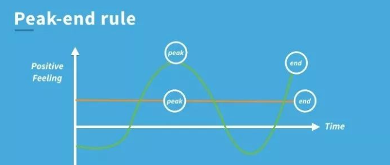

#### 入职一家新公司哪些因素是让你留下来的重要因素？

‌入职的第一天很大部分决定了你未来在这个公司开心不开心。

S公司入职第一天，hr把人带到主管面前，主管分配了一个座位，产品经理走到工位上开始巴拉巴拉讲解一个我接下来要做的项目。其中，连最基本的团队介绍都没有，没有人意识到，这是一个新员工新的工作，新的环境，新的同事，此时的工作让人非常不舒心，如果有一天要离职，我会没有丝毫的留念 。

Y公司入职第一天，与hr交谈愉快，人力资源部的小伙伴带着新员工熟悉整个集团的部门，然后交于所在部门管理人员，管理人员会热心的为你介绍每一位同事，并且同事都会热情的欢迎你，并且每年的活动会给当年新入职的员工准备一份惊喜礼物。

同等待遇发展前景情况下试问你更喜欢那一家公司？相信都会选择Y公司吧！

最近有幸读到《行为学设计》这本书给我感触很深，读了这本书，知道为什么会选择Y公司，作为HR也应该去思考，怎么去让新入职员工有一个更好的峰值体验。 行为设计学的福格行为模型告诉我们，**一切体验是可以被设计的！**

##### 福格行为模型

福格行为模型，它以BJ Fogg 命名。表明一个行为得以发生，行为者首先需要有进行此行为的动机和操作此行为的能力。接着，如果他们有充足的动机和能力来施行既定行为，他们就会在被诱导/触发时进行。

第一要有**动机**（Motivation），如果一个人对这件事没有做的意愿，是不会去做的。

第二要有**相应的能力**（Ability），也就是说这件事付出的成本越少越好，执行起来越简单越好。

第三是要**给一个适当触发点**（Trigger）：你得提醒他做这件事。但只有满足了以上两点，你的提醒才有意义。

里面的福格行为模型根据《思考快与慢》**峰终定律** 为依据，那么什么是**峰终定律**呢？

**峰终定律**（PeakEndRule）是诺贝尔奖得主、心理学家DanielKahneman得出的结论。

在DanielKahneman的一本书叫做《思考快与慢》有提到，峰终定律是指如果在一段体验的高峰和结尾，体验是愉悦的，那么对整个体验的感受就是愉悦的。

《行为设计学》这本书讲到了如何打造峰值体验：

**1、欣喜时刻：**欣喜时刻也是峰值时刻，即制造惊喜。例如公司第一年的圣诞节，我本未去抽奖，HR却单独给我留了一份礼物。

**2、认知时刻：**引导人们形成自己的思考，进而留下印象。

​		想象一个场景，老板问清洁阿姨，你为什么要把清洁做干净呢？

​		阿姨：我的工作让我必须把他打扫干净。

​		老板：打扫干净有什么好处呢？

​		阿姨：公司不扣我钱？员工心情愉悦？创造更多的价值？

在不断的询问中，让人们找到自己的价值所在！

**3、荣耀时刻：**里程碑式的时刻，人们可获取赞美，获得属于自己的“高光时刻”。

**4、连接时刻：**即和他们连接在一起，共享美好或者痛苦时刻的感觉。

那么我们回到第一个问题： 入职一家新公司哪些因素是让你留下来的重要因素？

我的回答是：待遇正常的情况下，呐!做人呢，最重要就是开心！！！

《行为学设计》《思考快与慢》 在生活中，可以运用到营销、产品设计、人事中。希望在以后生活中，可以把学到知识运用到实践中。

套用樊登老师的一句话：读书改变生活。 — 共勉